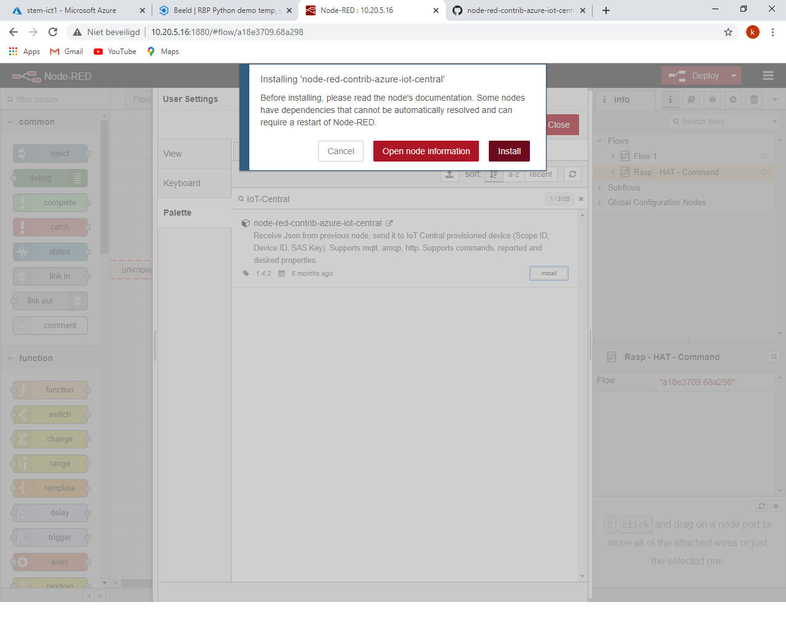

# IoT Central

## Doelstelling

In deze cursus gaan we data afkomstig van een IoT-device (microcontroller,
raspberry pi, ..) bewaren en visualiseren op een dashboard. Eveneens is het
mogelijk een actuator te bedienen vanop het dashboard.


## Inleiding

Azure is de cloud computing omgeving van Microsoft. Bij de cloud denken we
meestal aan het online bewaren van data (foto’s, documenten, .. ) bij One Drive,
Dropbox, Google Drive of een andere cloud opslag dienst.

Bij de cloud staat de data echter altijd op een fysieke server. Deze fysieke
server staat echter niet bij je thuis maar in een datacenter.

Enkele voorbeelden van datacenters bij Microsoft:

<https://www.youtube.com/watch?v=lMWBBCNaDB0>

<https://www.youtube.com/watch?v=9nLD7bc5O1g>

Bij cloud computing is het ook mogelijk om zelf virtuele servers op te zetten.
Hierbij maak je een virtuele server aan op een fysische server in het
datacenter. Deze virtuele server kan vervolgens dienst doen als webserver,
database, analyseren van data, ..

Enkele voordelen van cloud computing zijn:

-   Er moet door de gebruiker geen eigen hardware en software aangekocht worden
    voor een eigen datacenter.

-   De beveiliging van de infrastructuur zit bij de cloud provider.

-   De cloud provider maakt back-ups van de gegevens waardoor deze niet verloren
    kunnen gaan.

-   De rekenkracht van het datacenter wordt verdeeld over alle gebruikers van
    het datacenter.

De gebruiker moet enkel over een computer met internettoegang en een browser
beschikken. Via een portal krijgt de gebruiker toegang tot de nodige servers.

Meer uitleg over cloud computing kan je nalezen op
<https://www.true.nl/blog/wat-is-azure/>

## De portal van de azure cloud omgeving


Er zijn een aantal modellen mogelijk. Zowel SaaS (Software as a Service), Paas
(Platform as a Service) en IaaS (Infrastructure as a Service) zijn mogelijk met
Azure


### On-Premises 
Dit is geen cloudmodel. Alle servers, software, data en applicaties staan bij de gebruiker.


### IaaS        
Dit cloudservicemodel komt het dichtst in de buurt van het beheren van fysieke servers. Een cloudprovider houdt de hardware up-to-date, maar het onderhoud van het besturingssysteem en de netwerkconfiguratie blijft een taak van de gebruiker. Een voordeel van dit cloudservicemodel is de snelle implementatie van nieuwe toestellen. Het instellen van een nieuwe virtuele machine gaat aanzienlijk sneller dan het aanschaffen, installeren en configureren van een fysieke server. 

### PaaS        
Dit cloudservicemodel is een beheerde hostingomgeving. De cloudprovider beheert de virtuele machines en netwerkresources en de gebruiker implementeert de bijbehorende toepassingen in de beheerde hostingomgeving. 

### SaaS
In dit cloudservicemodel beheert de cloudprovider alle aspecten van de toepassingsomgeving, zoals virtuele machines, netwerkresources, gegevensopslag en toepassingen. De gebruiker hoeft alleen maar de gegevens op te geven bij de toepassing die door de cloudprovider wordt beheerd. 

##  Registratie Azure

Een gratis studentenaccount kan aangemaakt worden op
<https://azure.microsoft.com/nl-nl/free/students/>

Registreer je met je e-mailadres van school. Wanneer je registreert met een
ander e-mailadres, krijg je de vraag om met het e-mailadres van de school te
registeren.


Vul je telefoonnummer in als verificatie.


Registreer je


Ga akkoord met de voorwaarden.


## Resourcegroep

Wanneer je iets wil maken in Azure (Virtuele server, IoT-Hub, IoT-Central,
database, …) moet er een resourcegroep aangemaakt worden.

Kies + Een resource maken


Geef in het zoekvenster Resourcegroep in


Klik op Maken


Geef de resourcegroep een zelfgekozen naam en kies de dichtste locatie om de
resourcegroep te bewaren.


Klik vervolgens op Beoordelen en maken.


## Azure IoT-Central

Azure IoT-Central maakt gebruik van het SaaS (Software as a Service) model. In
deze cursus stuurt een IoT-apparaat (ESP8266, ESP32 of raspberry pi) data door
naar Azure IoT-Cental. De data wordt vervolgens weergegeven op een dashboard.
Nadien ben je in staat om data met een andere sensor door te sturen naar
IoT-Central en de data weer te geven op het dashboard.


Met het gratis pakket kunnen 30 000 berichten per maand verzonden worden.


## Aanmaak IoT-Central

Azure IOT-Central is een cloud applicatie (SaaS).

Maak deze cloud applicatie aan door in de portal te klikken op “+ Een resource
maken”.


Geef in het zoekvenster “IoT Central application” in:


Klik op Maken.


Vul een zelfgekozen Resourcenaam in. De URL wordt vervolgens gebaseerd op de
Resourcenaam. Selecteer het studentenabonnement en de vooraf aangemaakte
Resourcegroep.

Kies voor aangepaste toepassing als sjabloon en de dichtste locatie.


Wanneer alles goed gelukt is krijg je de melding dat de implementatie goed
gelukt is.


Selecteer in de Azure portal in IoT-Central-toepassing.


Klik op de URL van de aangemaakte toepassing.


Je komt op de portal van de aangemaakte IoT Central toepassing.


## Aanmaken Apparaatsjabloon

Voor een nieuw IoT-device moet eerst een sjabloon apparaat aangemaakt worden.

Maak een Apparaatsjabloon aan door op Apparaatsjablonen te klikken in de linker
balk. Kies vervolgens “+Nieuw”.


Kies als type “IoT-apparaat” en klik op “Volgende: Aanpassen”.


Voer een zelfgekozen naam in voor het apparaatsjabloon en klik op Volgende:
Beoordelen.


Klik op “Maken”.


Wanneer het sjabloon aangemaakt is krijg je bevestiging.


## Interface toevoegen

We voorzien voor het apparaat een interface. Een interface wordt gebruikt om een
sensorwaarde in te lezen of een actuator aan te sturen. In het voorbeeld
voorzien we het inlezen van 2 sensorenwaardes.

Klik op Aangepast model.


Klik op “Mogelijkheid toevoegen aan standaardonderdeel” en vul de gekozen
weergavenaam in. Wanneer je sensordata wil inlezen staat “Type van …” op
Telemetry. Het is eveneens mogelijk een eenheid toe te voegen. Dit is echter
geen verplichting.


Klik op “+ Een mogelijkheid toevoegen” om de 2de waarde van de interface toe te
voegen.


Indien we een actuator toevoegen moet je “Telemetry” aanpassen naar “Command”.


Klik op “Opslaan” om de interface te bewaren.

## Visuele weergave

Kies onder “Weergave” op “Het apparaat visualiseren”.


Voeg de grafische weergave toe onder Telemetrie. Klik vervolgens op “Tegel
toevoegen”.


Wanneer alles waardes toegevoegd zijn klik je op “Opslaan”.


Voor het sjabloon bruikbaar is moet dit gepubliceerd worden. Klik hiervoor op
“Publiceren”.


Klik nogmaals op “Publiceren”.


## Aanmaken apparaat

Maak vanuit het sjabloon een nieuw apparaat aan. Klik op “+ Nieuw” in Alle
apparaten.


Selecteer het ontworpen Apparaatsjabloon, pas indien nodig de apparaatnaam aan.


## ESP8266 arduino

In het voorbeeld sturen we data door met een ESP8266 microcontroller (thing)
naar Azure IOT-Central.

De voorbeeldcode is gebaseerd op <https://github.com/Azure/iot-central-firmware>
Download eventueel de volledige repository en unzip
deze.

De voorbeeldcode voor de esp8266 is te vinden onder het pad ESP8266. Het arduino
bestand is esp8266.ino. De nodige bestanden in de scr map moeten zeker altijd
aanwezig zijn bij het arduino bestand.

Vul de gegevens van het wifi netwerk in:

```cpp
#define WIFI_SSID "<ENTER WIFI SSID HERE>"
#define WIFI_PASSWORD "<ENTER WIFI PASSWORD HERE>"
```

De volgende delen code zijn afhankelijk van de instellingen in Azure IOT-central

```cpp
const char* SCOPE_ID = "<ENTER SCOPE ID HERE>";
const char* DEVICE_ID = "<ENTER DEVICE ID HERE>";
const char* DEVICE_KEY = "<ENTER DEVICE primary/secondary KEY HERE>";
```

De gegevens van het apparaat zijn te vinden in IoT-Central onder « Verbinding
met »:


Vul het « id-bereik », de « Apparaat-id » en de « primaire sleutel » in de
arduino code in.


Een voorbeeldprogramma met 2 tellers. Indien je andere waardes wil doorsturen in
een praktische toepassing pas je volgende stukje code aan:

```cpp
pos = snprintf(msg, sizeof(msg) - 1, "{\"teller1\": %d, \"teller2\":%d}", teller1, teller2);
```

De totale code:

```cpp
// Copyright (c) Microsoft. All rights reserved.
// Licensed under the MIT license. See LICENSE file in the project root for full
// license information.

// This gist is based on https://github.com/Azure/iot-central-firmware/blob/master/ESP8266/ESP8266.ino

#include <ESP8266WiFi.h>
#include "src/iotc/common/string_buffer.h"
#include "src/iotc/iotc.h"

#define WIFI_SSID "SSID"
#define WIFI_PASSWORD "PASW"

const char* SCOPE_ID = "SCOPE_ID";
const char* DEVICE_ID = "DEVICE_ID";
const char* DEVICE_KEY = "DEVICE_KEY";

int teller1=0;
int teller2=0;

void on_event(IOTContext ctx, IOTCallbackInfo* callbackInfo);
#include "src/connection.h"

void on_event(IOTContext ctx, IOTCallbackInfo* callbackInfo) {
  // ConnectionStatus
  if (strcmp(callbackInfo->eventName, "ConnectionStatus") == 0) {
    LOG_VERBOSE("Is connected ? %s (%d)",
                callbackInfo->statusCode == IOTC_CONNECTION_OK ? "YES" : "NO",
                callbackInfo->statusCode);
    isConnected = callbackInfo->statusCode == IOTC_CONNECTION_OK;
    return;
  }

  // payload buffer doesn't have a null ending.
  // add null ending in another buffer before print
  AzureIOT::StringBuffer buffer;
  if (callbackInfo->payloadLength > 0) {
    buffer.initialize(callbackInfo->payload, callbackInfo->payloadLength);
  } 
  LOG_VERBOSE("- [%s] event was received. Payload => %s\n",
              callbackInfo->eventName, buffer.getLength() ? *buffer : "EMPTY");
  
  if (strcmp(callbackInfo->eventName, "Command") == 0) {
    LOG_VERBOSE("- Command name was => %s\r\n", callbackInfo->tag);
  }
  
  if (strcmp(callbackInfo->eventName, "SettingsUpdated") == 0) {
    LOG_VERBOSE("- Setting name was => %s\r\n", callbackInfo->tag);
  }
}

void setup() {
  Serial.begin(9600);

  connect_wifi(WIFI_SSID, WIFI_PASSWORD);
  connect_client(SCOPE_ID, DEVICE_ID, DEVICE_KEY);

  if (context != NULL) {
    lastTick = 0;  // set timer in the past to enable first telemetry a.s.a.p
  }
}

void loop() {
  if (isConnected) {
    unsigned long ms = millis();
    if (ms - lastTick > 5000) {  // send telemetry every 5 seconds
      char msg[128] = {0};
      int pos = 0, errorCode = 0;

      lastTick = ms;
      teller1++;
      teller2=teller2+2;
       
      pos = snprintf(msg, sizeof(msg) - 1, "{\"teller1\": %d, \"teller2\":%d}", teller1, teller2);
      errorCode = iotc_send_telemetry(context, msg, pos);

      msg[pos] = 0;

      if (errorCode != 0) {
        LOG_ERROR("Sending message has failed with error code %d", errorCode);
      }
    }

    iotc_do_work(context);  // do background work for iotc
  } else {
    iotc_free_context(context);
    context = NULL;
    connect_client(SCOPE_ID, DEVICE_ID, DEVICE_KEY);
  }
}
```

## ESP32 arduino

In het voorbeeld sturen we data door met een ESP32 microcontroller (thing)
naar Azure IOT-Central. Eveneens sturen we vanop het dashboard in Azure IoT-Central een actuator aan op de ESP32.

Download het voorbeeldprogramma van ...... (nog aan te vullen)

De instellingen van het wifi netwerk en de verbinding met Azure is mogelijk in de config.h file.

Vul de gegevens van het wifi netwerk in:

```cpp
#define WIFI_SSID "<ENTER WIFI SSID HERE>"
#define WIFI_PSK "<ENTER WIFI PASSWORD HERE>"
```
Zorg dat IOT_CENTRAL op true staat.

```cpp
#define IOT-Central true
```

De volgende delen code zijn afhankelijk van de instellingen in Azure IOT-central

```cpp
const char* SCOPE_ID = "<ENTER SCOPE ID HERE>";
const char* DEVICE_ID = "<ENTER DEVICE ID HERE>";
const char* DEVICE_KEY = "<ENTER DEVICE primary/secondary KEY HERE>";
```

De gegevens van het apparaat zijn te vinden in IoT-Central onder « Verbinding
met »:


Vul het « id-bereik », de « Apparaat-id » en de « primaire sleutel » in de
arduino code in.


## Python op raspberry pi

Bron: Dieter De Preester docent HoWest MCT

## Installatie Azure-iot-device

Installeer op de raspberry pi met pip3 de azure-iot-device lib.


De gegevens van het apparaat zijn te vinden in IoT-Central onder « Verbinding
met »:


Vul het « id-bereik », de « Apparaat-id » en de « primaire sleutel » in de
arduino code in.


Een voorbeeldprogramma waarbij een random temperatuur doorgezonden wordt. Indien
je andere waardes wil doorsturen in een praktische toepassing pas je volgende
stukje code aan:

```python
            temp = random.randint(0, 100)
            data = {"temperature" :  temp }
```

Een actuator op de raspberry pi aansturen via het dashboard is mogelijk met volgende code


De totale code:

```python
import asyncio
import os
from azure.iot.device.aio import IoTHubDeviceClient, ProvisioningDeviceClient
from azure.iot.device import MethodResponse
 
import random
import json

id_scope = ''
device_id = ''
primary_key = ''

# Declare the device client so it can be used from all the function
device_client = None

# Provisions the device with the Azure device provisioning service or returns
# the connection details if the device is already provisioned
async def register_device():
    provisioning_device_client = ProvisioningDeviceClient.create_from_symmetric_key(
        provisioning_host='global.azure-devices-provisioning.net',
        registration_id=device_id,
        id_scope=id_scope,
        symmetric_key=primary_key,
    )

    return await provisioning_device_client.register()


async def property_handler(patch):
    print("Patch received:", patch)

async def command_handler(method_request):
    print("Message received:", method_request.name)
    print("Message payload:", method_request.payload)

    # Determine how to respond to the command based on the IoT Hub direct method method name
    # which is the same as the IoT Central command name
    if method_request.name == "StartSending":
        # For an On request, set the color based on the payload
 
        print("StartSending")
    elif method_request.name == "StopSending":
        # For an Off request, set the color to 000000, which turns the pixels off
 
        print("StopSending")
    else:
        print("Received unknown method: " + method_request.name)

    # Method calls have to return a response so IoT Central knows it was handled correctly,
    # So send a 200 response to show we handled this
    payload = {"result": True}
    status = 200

    # Send the response
    method_response = MethodResponse.create_from_method_request(method_request, status, payload)
    await device_client.send_method_response(method_response)

# The main async function that runs the app
async def main():
    global device_client
    
    # Regsiter the Pi as an IoT device in IoT Central
    registration_result = await register_device()

    # Build the IoT Hub connection string from the registration details
    # IoT Central sits on top of IoT Hub, and the Python SDK only supports IoT Hub,
    # So to talk to IoT central the IoT Hub connection string needs to be built from details
    # from registering the device with the provisioning service
    conn_str='HostName=' + registration_result.registration_state.assigned_hub + \
                ';DeviceId=' + device_id + \
                ';SharedAccessKey=' + primary_key

    # The client object is used to interact with your Azure IoT Central app via IoT Hub, so create this 
    # from the connection string
    device_client = IoTHubDeviceClient.create_from_connection_string(conn_str)

    # Connect the client to IoT Hub
    print('Connecting')
    await device_client.connect()
    print('Connected')

    # IoT Central stores properties in the device twin, so read this to see if we have a color
    # stored from the last run for the lights. This way when the device starts up it can set the color
    # to the last setting
 

 

    # Set the method request handler on the client to handle IoT Central commands
    device_client.on_method_request_received = command_handler

    # Handle updates to the color property from IoT Central
    device_client.on_twin_desired_properties_patch_received = property_handler

    # Define a message loop that keeps the app alive whilst listening for commands
    async def main_loop():
        while True:
            temp = random.randint(0, 100)
            data = {"temperature" :  temp }
            await device_client.send_message(json.dumps(data))
            print(json.dumps(data))
            await asyncio.sleep(5)

    # Wait for user to indicate they are done listening for method calls
    await main_loop()

    # Finally, disconnect
    await device_client.disconnect()

# Start the async app running
if __name__ == "__main__":
    asyncio.run(main())
```

## Node red

In onderstaande voorbeeld wordt:

-   data (temperatuur, luchtvochtigheid en luchtdruk) afkomstig van het sense
    HAT bord verzonden vanuit node red op een rapsberry pi naar IoT Central.

-   De leds op het sense HAT bediend vanuit het IoT-Central dashboard


De uitwerking is gebaseerd op volgende document
<https://pietrobrambati.blog/2020/08/21/sending-commands-from-azure-iot-central-to-raspberry-pi-with-sense-hat-in-node-red/>

## Installatie node-red

Installeer indien nodig node-red op de raspberry pi.
<https://nodered.org/docs/getting-started/raspberrypi>

Open node-red via de browser door het IP-adres en de poort 1880 in de browser in
te voeren:


## Importeren van modules in node red

Voeg de bibliotheek voor azure-iot-central toe. Klik op de 3 horizontale strepen
rechtsboven en kies “Settings” 

Kies “Palette” in de user Settings en vervolgens het tabblad “Install”


Geef bij “search modules” “Iot-Central” in klik op “install” bij
node-red-contrib-azure-iot-central.


Klik terug op Install.



Voeg de bibliotheek voor azure-iot-central toe. Klik op de 3 horizontale strepen
rechtsboven en kies “Settings” 

Kies “Palette” in de user Settings en vervolgens het tabblad “Install”


Geef bij “search modules” “Sensehat” in klik op “install” bij
node-red-pi-sense-hat.


Klik terug op Install.


Kies import in node-red.


Kopieer de json string van
<https://github.com/pietrobr/node-red-contrib-azure-iot-central/blob/master/samples/flow%20SenseHAT%20commands.json>


Plaats de json string in node red en klik op “Import”.


## Azure IoT-Central

Maak een nieuw apparaatsjabloon aan met een zelfgekozen naam.


Voorzie de interface door op “Aangepast model” te klikken.


Vul de weergavenaam en de eenheid in voor:

-   Temperatuur sensor telemetry

-   Humidity sensor telemetry

-   Pressure sensor telemetry

-   turnLedOn bediening actuator Command

-   turnLedOff bediening actuator Command


Klik op “Opslaan”


## Visualisatie

Klik op “Het apparaat visualiseren”


Voeg voor de temperatuur, de luchtdruk en de luchtvochtigheid een tegel toe door
de grootheid te selecteren onder Telemetrie en vervolgens op “Tegel toevoegen”
te klikken.


Voeg de bediening toe door bij Opdrachten de bediening te slecteren.


Wanneer alle tegels toegevoegd zijn klik je op “Opslaan” en vervolgens op
“Publiceren”.


Voeg het device toe door op “+Nieuw” te klikken.


Selecteer het aangemaakte sjabloon.


## Instellingen in node-red

Dubbelklik op


Vul de Scope ID, Device ID en Primary Key afkomstig van IoT-Central in.


Pas eventueel de tijd aan om berichten door te sturen.


## Alarmen instellen

Kies “Regels”


Kies om een nieuwe regel in te stellen. Druk op “+Nieuw”

-   Geef de regel een naam.

-   Selecteer het appartaatsjabloon

-   Stel de voorwaarde in

-   Kies een actie


## Gebruikers

De data kan zichtbaar gemaakt worden voor andere gebruikers. Kies “Beheer” en
vervolgens “Gebruikers”


Klik op “+ Nieuwe gebruiker” vul het email adres in van de gebruiker en kies
zijn rol.


## License

<a rel="license" href="http://creativecommons.org/licenses/by-sa/4.0/"></a><br />This work is licensed under a <a rel="license" href="http://creativecommons.org/licenses/by-sa/4.0/">Creative Commons Attribution-ShareAlike 4.0 International License</a>.

[](https://app.netlify.com/sites/innovet-azure-iot-central/deploys)